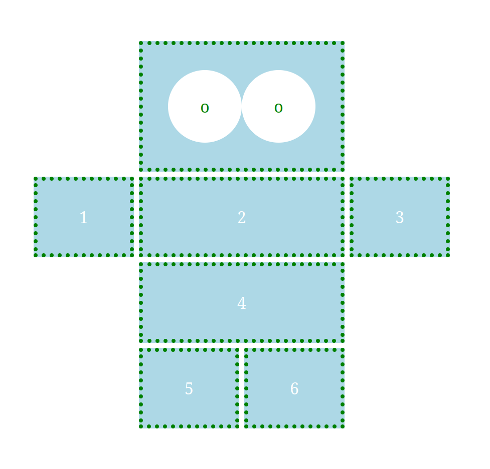
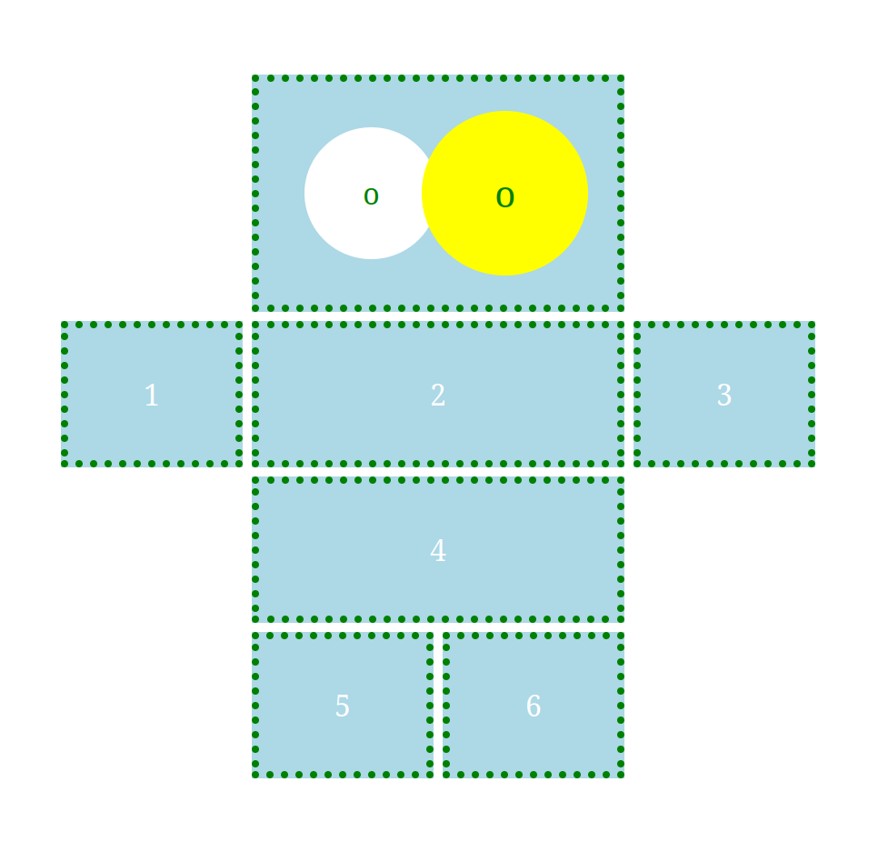
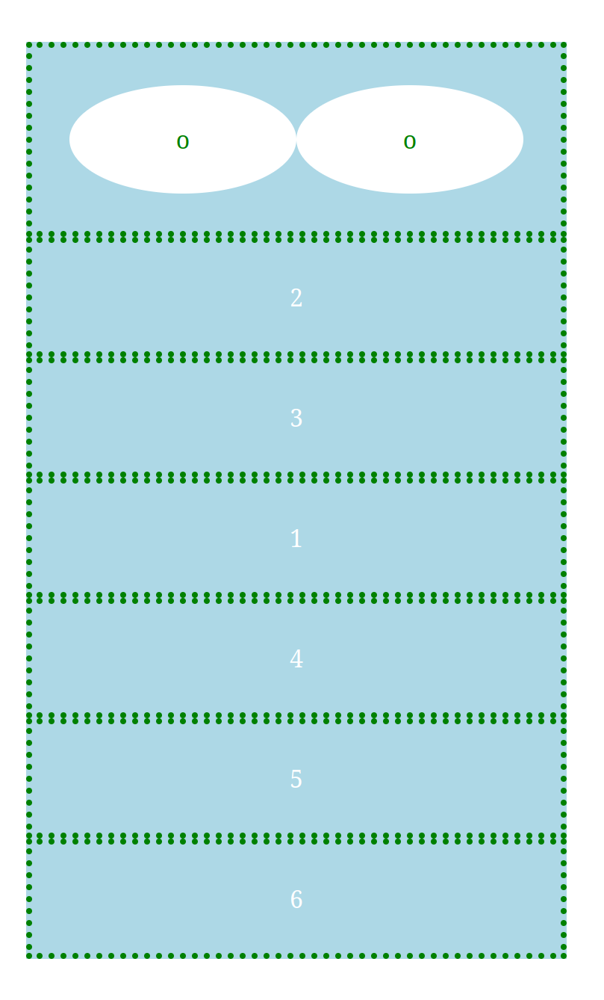
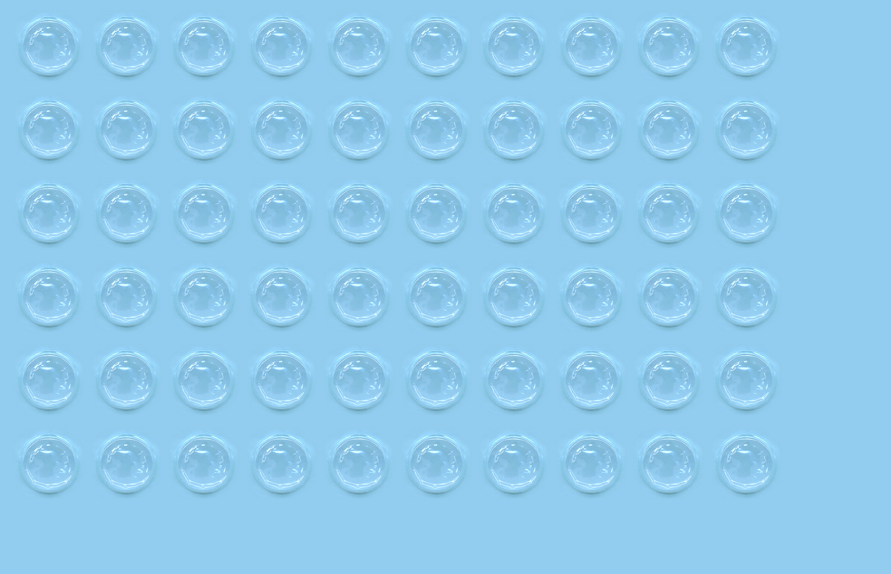
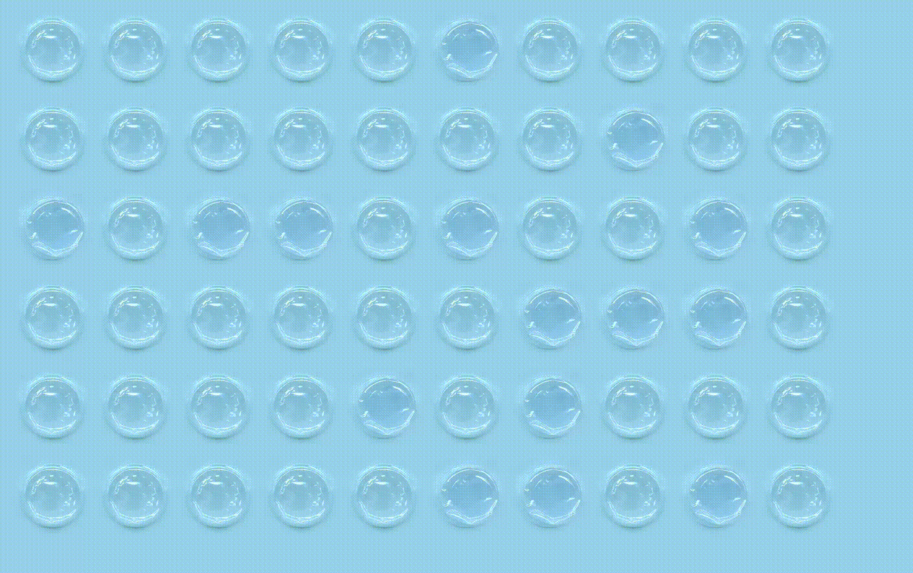
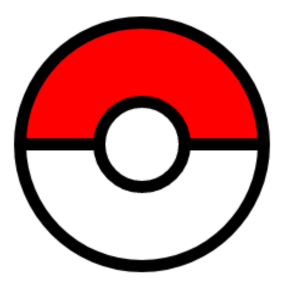
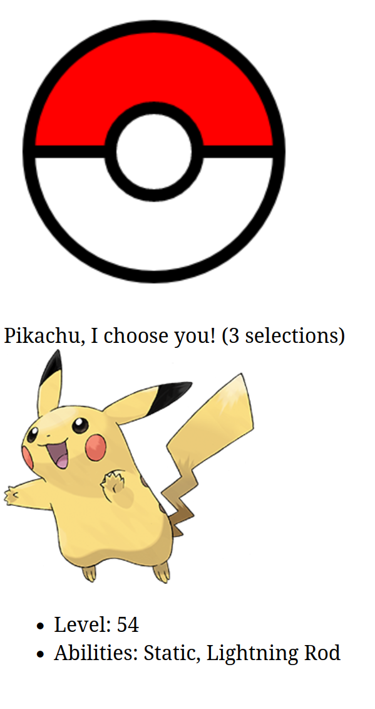

# Examinare seria 15

Trimiteți rezolvările (toate fișierele folosite în rezolvări, inclusiv fișierele furnizate pe această pagină) într-o arhivă .zip cu numele de forma `nrgrupa_nume_prenume.zip` la adresa `claudia-elena.chirita@unibuc.ro` într-un mail cu subiectul `Test Tehnici Web seria 15`. Toate subiectele sunt obligatorii. Condiția de promovare a examinării este obținerea a 3 puncte din 6.

## A. layout, tranziții, media query (1.5 puncte)
1. Scrieți un fișier HTML `layout.html` care să conțină un div cu clasa `container`. În interiorul lui, adăugați încă alte 9 divuri. Creați un fișier `layout.css` în care să adăugați reguli CSS astfel încât pagina să arate ca în imaginea de mai jos și:
- fiecare coloană să aibă lățimea de 100px
- spațiul dintre linii și coloane să fie de 5px
- divurile să aibă padding de 25px
- textul să fie centrat pe orizontală
- divurile (mai puțin cercurile) vor avea fundal `lightBlue`, textul colorat cu alb și border verde, punctat, de 4px
- divurile în formă de cerc nu vor avea border, vor avea textul colorat cu verde și fundal alb.

2. Adăugați reguli CSS astfel încât la trecerea mouse-ului deasupra divurilor în formă de cerc
- divurile vor avea fundal galben și textul colorat verde
- se vor mări (1.25*mărimea inițială), treptat, într-o tranziție de 0.4s.
 

3. Scrieți un media query pentru ferestre cu lățimea între 200px și 600px astfel încât divurile să nu mai fie afișate cu layoutul de mai sus, ci în formatul default, unele sub altele, ocupând întreaga lațime a containerului, precum în imaginea de mai jos.

## B. burst the bubble: events, DOM, localStorage (2.5 puncte)

4. Scrieți un fișier HTML `burst.html` care să conțină un body gol și să încarce fișierul de stil `burst.css` pe care îl puteți găsi în directorul `resources`. Adăugați cod JavaScript în fișierul `burst.js` astfel încât să creați în mod dinamic un tabel cu 6 rânduri și 10 coloane. Fiecare celulă din tabel va conține imaginea `bubble0.jpg` din directorul `resources/images` cu lățimea de 60px.

5. La apăsarea unei bule de pe ecran, aceasta sa va 'sparge'. Imaginea din celula de tabel se va schimba, fiind înlocuită cu imaginea `bubble1.jpg` din directorul `resources/images`. În plus, va fi cântat ('played') un sunet, ales aleator din cele trei sunete furnizate în directorul `resources/sounds` (`bubble1.mp3`, `bubble2.mp3`, `bubble3.mp3`). Hint: folosiți elementul html `audio` (încărcat dinamic cu JavaScript). 

6. La apăsarea tastei `b`, se va sparge o bulă aleasă aleator. La apăsarea tastei `r`, derulăm banda (bubble wrap infinit!), rând cu rând. La fiecare 500 milisecunde se va apela o funcție `reset()` care va șterge primul rând din tabel și va adăuga un rând nou la finalul tabelului (cu celule conținând imaginea originală, `bubble0.jpg`). Funcția `reset()` se va apela de suficiente ori pentru a înlocui toate rândurile tabelului cu rânduri cu bule nesparte. Atenție: animați înlocuirea rând cu rând, precum în imaginea de mai jos.

5. Salvați în `localStorage` numărul de bule sparte în total și afișați-l în colțul din dreapta sus a ecranului.

## C. gotta catch them all: events, canvas, fetch (2 puncte)

9. Scrieți un fișier HTML `poke.html` astfel încât să desenați, folosind fie elementul `canvas` (și cod JavaScript), fie cod CSS, un pokeball ca în imaginea de mai jos (hint: cercul mare are 100px, cel mic 35px, grosimea liniei este de 10px).

Dacă nu știți să desenați mingea folosind canvas sau CSS, puteți folosi imaginea 'resources/images/poke.png' pentru a continua rezolvarea subiectului (cu punctaj parțial, pentru neîndeplinirea primei cerințe).

10. La apăsarea bilei, se va alege un pokemon din lista de pokemoni din fișierul `poke.json` (care poate fi descărcat din directorul `resources`). Folosiți fetch și promisiuni pentru a accesa conținutul fișierului pe un server http local (porniți un server http folosind, de exemplu, Python). La fiecare click pe bilă, se va alege aleator unul din pokemoni și se va afișa sub bilă un mesaj de forma "Nume-pokemon, I choose you! (number selections)". Numele pokemonului va fi extras din fișierul .json, iar numărul de selecții (de câte ori a fost ales pokemonul curent) va fi contorizat folosind `sessionStorage`.

11. La trecerea cu mouse-ul deasupra imaginii pokemonului ales, se va afișa sub imagine o listă neordonată conținând nivelul și abilitățile pokemonului extrase din fișierul .json.

